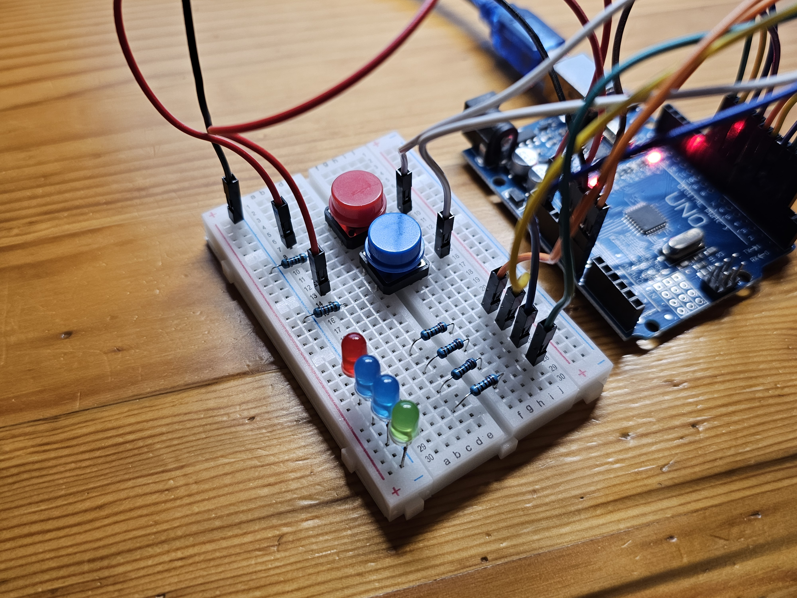
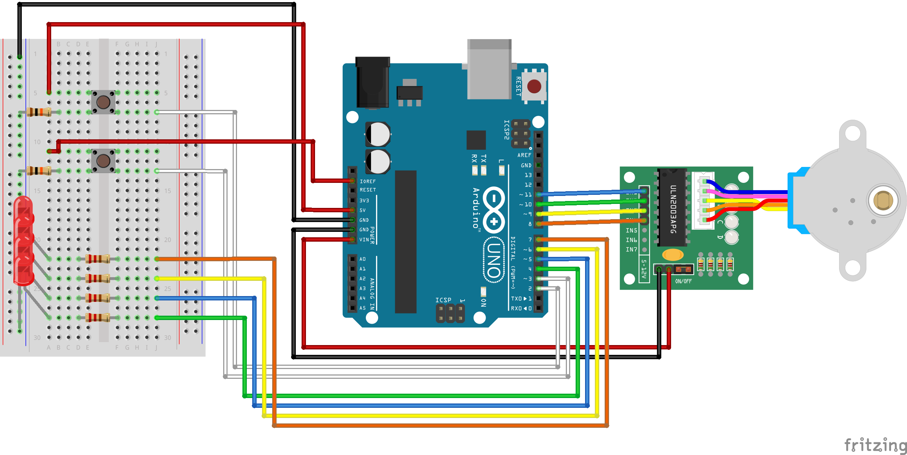
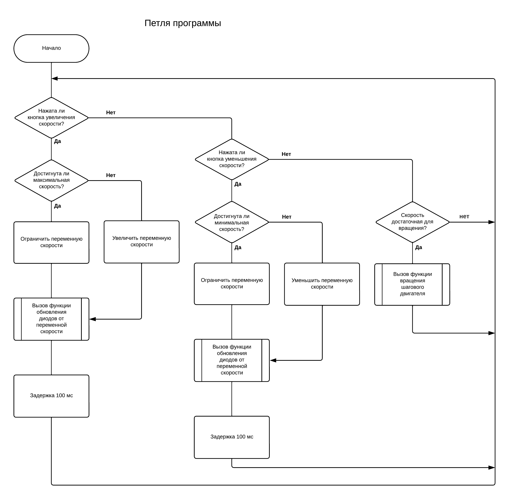
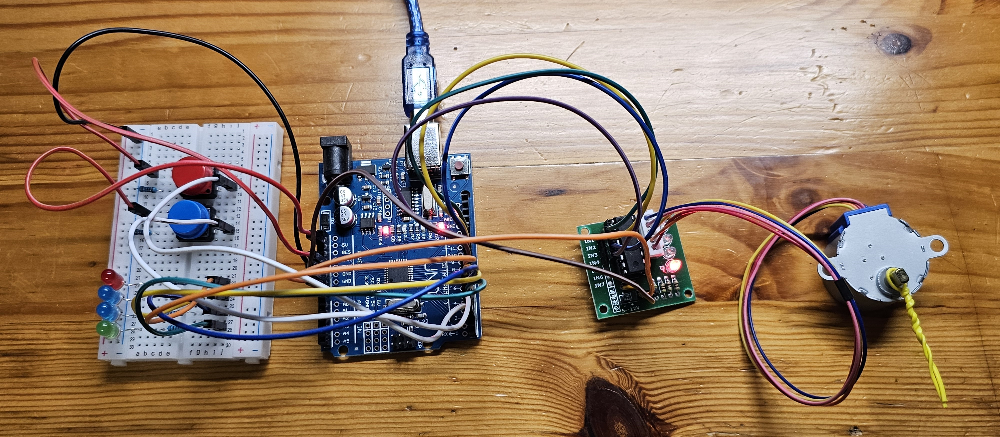
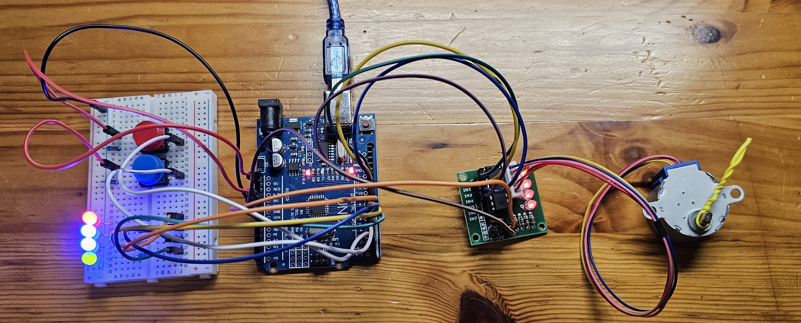

# Stepper Motor Control System (Arduino)

This project is a microcontroller-based system designed for precise control of a 28BYJ-48 stepper motor using an Arduino Uno. It features dynamic speed adjustment via hardware buttons and real-time visual speed indication through an LED array. Originally developed as my university coursework project in automated information processing systems.

  

<table>
  <tr>
    <td></td>
    <td></td>
    <td></td>
    <td></td>
  </tr>
</table>

## Key Features

*   **Dynamic Speed Control:** Smoothly increase or decrease the motor's rotational speed using dedicated tactile buttons.
*   **Visual Speed Indication:** A 4-LED array displays the current speed as a percentage of the maximum capacity (25%, 50%, 75%, 100%).
*   **Custom Motor Driving:** Implements a direct half-step sequence logic for stepper motor control without relying on external libraries.
*   **Hardware Safety:** Utilizes internal pull-up resistors for button logic and a dedicated driver for motor current management.

## Hardware Components

The system is built using standard, accessible electronic components:

*   **Microcontroller:** Arduino Uno (ATmega328P, 16MHz)
*   **Motor:** 28BYJ-48 Stepper Motor
*   **Motor Driver:** ULN2003AN module
*   **Inputs/Outputs:** Tactile buttons, 4 LEDs, and standard breadboard wiring

## Software Stack & Code Structure

The repository contains the C++ firmware developed in the Arduino IDE.
*   **stepper_control.ino**: The main executable file. It initializes the hardware ports, monitors button states, and applies bitwise operations to write step sequences directly to the driver pins.
*   **Step Sequence Logic:** Uses an 8-step array to control the exact phase excitation required for motor rotation.
*   **Delay Management:** Speed control is achieved by dynamically adjusting the `delayMicroseconds()` interval between step pulses.

## How to Run

1. Open the `.ino` file in the Arduino IDE.
2. Connect your Arduino Uno to the computer via USB.
3. Wire the components according to the standard ULN2003 driver and Arduino Uno pinout matching the code definitions (Pins 8-11 for the motor, 2-3 for buttons, 4-7 for LEDs).
4. Select `Arduino Uno` in the Boards manager and choose the appropriate COM port.
5. Click `Upload` to flash the firmware.
6. Press the buttons to start the motor rotation and observe the LED speed indicators.

## Documentation

For an in-depth look at the project architecture, including flowcharts, electrical schematics, and hardware justification, please refer to the comprehensive explanatory note (in Russian):
Coursework_3.pdf
